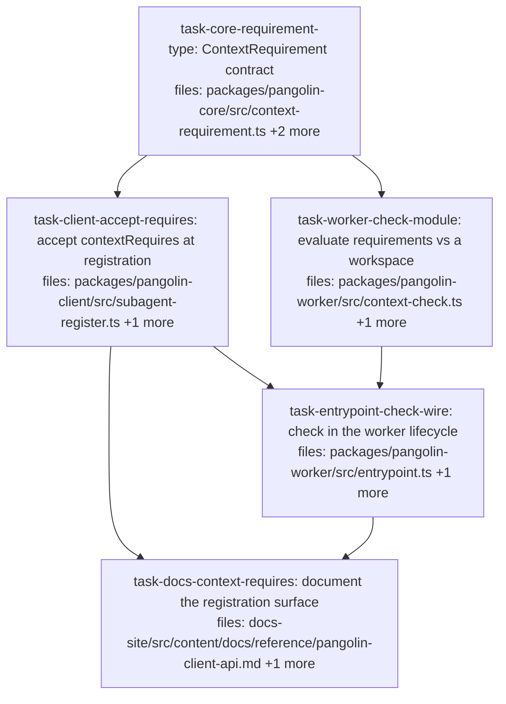

## Context

Implements v1 of [`../specs/2026-08-03-staged-context-verification-design.md`](../specs/2026-08-03-staged-context-verification-design.md).

**v1 is verification only — no declaration, no prompt rendering.** That ordering was
inverted from the first draft on consumer evidence: a declaration nobody checks is
the failure this area keeps producing (`contextShape` has five declaration sites and
zero readers), so shipping a declaration first would add a sixth unread declaration
to a system whose problem is unread declarations. The consumer's line settles it:
*"I'll keep hand-writing briefs; I can't hand-write detection."*

**The problem is drift, not ignorance.** Agents are not under-informed — authored
briefs are more explicit than any generated manifest. What is missing is detection
when a brief goes stale: bind a new toolchain bundle and a brief's 22 true statements
become false with nothing noticing.

**Failing before the agent runs is about misattribution, not false greens.** When a
requirement is unmet, the agent gets `command not found` at agent time, which reads
as a plan problem — the consumer lost a cycle to that class with the real cause four
layers from the report. Failing at the check point names the cause where it is
knowable.

**Placement follows the packs decision spec (option A).** `contextRequires` lives on
the subagent def, which the worker already reads — not on `SubagentShape`, which per
ADR-0018 D11 the worker is ignorant of. The worker is the only thing that can observe
a workspace, so the requirement must be somewhere the worker can read. This does
**not** rest on both-paths coverage; the first consumer is orchestrator-only and
asked not to be counted as evidence for that.

**Explicit non-goal.** This does not give a verifier the base tree and does not check
"patch applied" — that is unverifiable by observation, and it is the half of issue 17
that stays open. No task here should be read as closing 17.

## Tasks

## Task: core contract for context requirements

```yaml
id: task-core-requirement-type
depends_on: []
files:
  - packages/pangolin-core/src/context-requirement.ts
  - packages/pangolin-core/src/index.ts
  - packages/pangolin-core/test/context-requirement.test.ts
status: pending
quality_reviewer_hint: opus
```

Defines the requirement vocabulary as a discriminated union in core, so the client
(which persists it) and the worker (which evaluates it) share one shape. Every member
must be answerable by **observation alone** — the union deliberately cannot express
intent such as "patch applied", because checking that means re-doing the apply rather
than observing a property.

## Implementation

```typescript
// packages/pangolin-core/src/context-requirement.ts
/**
 * A property of the staged workspace that can be OBSERVED, not inferred.
 *
 * Deliberately excludes anything asserting intent — "patch applied", "snapshot at
 * revision" — because verifying those requires the diff and the base, which is
 * re-doing the work rather than checking it. Adding such a member would make the
 * union unfalsifiable, which is the defect this vocabulary exists to avoid.
 *
 * Ecosystem-neutral by construction: no member names git, npm, or a language.
 * `git` is a storage-shape predicate, not a package-manager one.
 */
export type ContextRequirement =
  | { kind: 'paths'; glob: string; minCount?: number }
  | { kind: 'exec'; bin: string }
  | { kind: 'git'; needs: 'history' | 'worktree' };
```

```typescript
// packages/pangolin-core/test/context-requirement.test.ts
import type { ContextRequirement } from '../src/context-requirement.js';
import { it, expect } from 'vitest';

it('the union admits all three observable kinds and rejects an intent claim', () => {
  const reqs: ContextRequirement[] = [
    { kind: 'paths', glob: 'node_modules/**', minCount: 1 },
    { kind: 'exec', bin: 'pnpm' },
    { kind: 'git', needs: 'history' },
  ];
  expect(reqs.map((r) => r.kind)).toEqual(['paths', 'exec', 'git']);
  // @ts-expect-error — 'patch-applied' is deliberately NOT expressible (spec §3)
  const rejected: ContextRequirement = { kind: 'patch-applied' };
  expect(rejected).toBeDefined();
});
```

## Acceptance criteria

- `ContextRequirement` is exported from `packages/pangolin-core/src/index.ts` and
  importable as `import type { ContextRequirement } from '@quarry-systems/pangolin-core'`.
- All three kinds — `paths`, `exec`, `git` — are constructible, asserted by an array
  whose `.map(r => r.kind)` equals exactly `['paths','exec','git']`. The exact-array
  assertion is deliberate: `toContain` would pass with one kind missing.
- `{ kind: 'patch-applied' }` does not typecheck, pinned with `@ts-expect-error`.
  **Documentation-grade, not build-enforced** — `pangolin-core` has no
  `tsconfig.test.json` and no `typecheck:test` script, so this matches the existing
  unenforced idiom at `test/refs.test.ts:7-8`. The union itself IS enforced by
  `pnpm -r typecheck` at every `src/` construction site.
- Every pre-existing `pangolin-core` test passes unmodified.

Test file: `packages/pangolin-core/test/context-requirement.test.ts`.

## Task: accept contextRequires at subagent registration

```yaml
id: task-client-accept-requires
depends_on: [task-core-requirement-type]
files:
  - packages/pangolin-client/src/subagent-register.ts
  - packages/pangolin-client/test/context-requires.test.ts
status: pending
```

Adds `contextRequires?: ContextRequirement[]` to `RegisterSubagentOpts`
(`subagent-register.ts:30`) and persists it onto the content-hashed def. **The
hash-stability requirement is load-bearing:** six client test files assert subagent
content hashes, so the field must be written only when set, mirroring `verify`
exactly at `:79`.

## Implementation

```typescript
// packages/pangolin-client/src/subagent-register.ts
export interface RegisterSubagentOpts {
  // ...existing fields unchanged
  /** Observable properties the staged workspace must satisfy. Verified by the
   *  worker before the agent runs; an unmet requirement fails the dispatch. */
  contextRequires?: ContextRequirement[];
}

// In the def builder, IMMEDIATELY beside the existing `verify` line (:79) and for
// the same reason — additive + hash-stable, so subagents without it keep their
// exact content hash and the six test files asserting those hashes stay green.
if (opts.verify) def.verify = opts.verify;
if (opts.contextRequires) def.contextRequires = opts.contextRequires;
```

```typescript
// packages/pangolin-client/test/context-requires.test.ts
it('a subagent registered WITHOUT contextRequires keeps its exact content hash', async () => {
  const before = await registerSubagent(client, { name: 'a', systemPrompt: 'x' });
  const after = await registerSubagent(client, { name: 'a', systemPrompt: 'x' });
  // Control: registration actually produced a hash, so equality is not two undefineds.
  expect(before.contentHash).toMatch(/^sha256:[0-9a-f]+$/);
  expect(after.contentHash).toBe(before.contentHash);
});
```

## Acceptance criteria

- A subagent registered with `contextRequires: [{kind:'exec',bin:'pnpm'}]` stores that
  array verbatim on its def blob, read back by fetching the pinned URI and parsing.
- A subagent registered **without** `contextRequires` produces a def with no
  `contextRequires` key — `'contextRequires' in def` is `false` — and its
  `contentHash` matches `/^sha256:[0-9a-f]+$/`. The hash-shape assertion is the
  control proving registration ran rather than returning an empty object.
- **Hash stability, stated as a concrete equality:** registering
  `{name:'a', systemPrompt:'x'}` before and after this change yields the *same*
  `contentHash`. Verify by asserting the value equals the one the current code
  produces for that exact input, captured before the edit — not by asserting it
  merely "did not throw".
- Two registrations differing only in `contextRequires` produce **different** content
  hashes, so the field genuinely participates in identity when present.
- All six pre-existing client test files that assert subagent content hashes
  (`cancel`, `describe`, `dispatch`, `dispatch-fire`, `integration`, `retention`)
  pass unmodified.

Test file: `packages/pangolin-client/test/context-requires.test.ts`.

## Task: evaluate requirements against a workspace

```yaml
id: task-worker-check-module
depends_on: [task-core-requirement-type]
files:
  - packages/pangolin-worker/src/context-check.ts
  - packages/pangolin-worker/test/context-check.test.ts
status: pending
quality_reviewer_hint: opus
```

Pure evaluation of a requirement list against a real workspace directory. Returns a
per-requirement result rather than a boolean, because the failure detail must name
**which** requirement failed and what was observed instead — that naming is the whole
point (spec §4.4: an unmet requirement discovered later gets blamed on the wrong
thing).

## Implementation

```typescript
// packages/pangolin-worker/src/context-check.ts
import { access, readdir } from 'node:fs/promises';
import { join, delimiter } from 'node:path';
import type { ContextRequirement } from '@quarry-systems/pangolin-core';

export interface RequirementResult {
  requirement: ContextRequirement;
  met: boolean;
  observed: string; // human-readable, goes into the failure detail
}

/**
 * `env` is the MERGED runtime env — the same one the agent will receive — not the
 * worker's own `process.env`. Resolving `exec` against the worker's PATH would
 * answer a different question than "can the agent run this", which is the question
 * asked. filterRuntimeEnv may legitimately drop entries the worker holds.
 */
export async function checkContextRequirements(
  workspaceDir: string,
  reqs: ContextRequirement[],
  env: Record<string, string>,
): Promise<RequirementResult[]> {
  const out: RequirementResult[] = [];
  for (const requirement of reqs) {
    if (requirement.kind === 'exec') {
      const dirs = (env.PATH ?? '').split(delimiter).filter(Boolean);
      let found = '';
      for (const d of dirs) {
        try { await access(join(d, requirement.bin)); found = join(d, requirement.bin); break; } catch { /* next */ }
      }
      out.push({ requirement, met: found !== '', observed: found || `not on PATH (${dirs.length} entries searched)` });
    }
    // 'paths' and 'git' follow the same shape: observe, never infer.
  }
  return out;
}
```

```typescript
// packages/pangolin-worker/test/context-check.test.ts
it('exec resolves against the PASSED env PATH, not the worker process PATH', async () => {
  const dir = await mkdtemp(join(tmpdir(), 'cc-'));
  const binDir = join(dir, 'bin');
  await mkdir(binDir, { recursive: true });
  await writeFile(join(binDir, 'faketool'), '#!/bin/sh\n');
  const [hit] = await checkContextRequirements(dir, [{ kind: 'exec', bin: 'faketool' }], { PATH: binDir });
  const [miss] = await checkContextRequirements(dir, [{ kind: 'exec', bin: 'faketool' }], { PATH: '/nonexistent' });
  // Positive control: the same binary IS found when PATH includes it, so the miss
  // below is about PATH and not about a broken probe.
  expect(hit.met).toBe(true);
  expect(miss.met).toBe(false);
});
```

## Acceptance criteria

- `exec`: a binary present in a directory named by the **passed** `env.PATH` is
  `met: true`; the same binary with a `PATH` not containing it is `met: false`. Both
  asserted in one test — the hit is the control proving the miss is about `PATH`.
- `exec` does **not** consult `process.env.PATH`: with `env.PATH` set to a directory
  containing the binary and `process.env.PATH` cleared for the call, the result is
  still `met: true`.
- `paths`: a glob matching one or more files is `met: true` with `observed` naming a
  count; a glob matching none is `met: false`. `minCount: 2` against exactly one
  match is `met: false`, while the same glob with `minCount: 1` is `met: true` — the
  pair proves `minCount` is read rather than ignored.
- `git`: `needs: 'history'` is `met: true` in a directory with a repo carrying at
  least one commit, and `met: false` in a directory with no `.git`. Both in one test.
- Every result carries a non-empty `observed` string, including on `met: true` —
  asserted across all three kinds, since the failure detail is the deliverable.
- The function never throws for any requirement kind against a nonexistent
  `workspaceDir`; it returns `met: false` results. Asserted with
  `await expect(...).resolves.toHaveLength(3)` so a rejection fails the test.

Test file: `packages/pangolin-worker/test/context-check.test.ts`.

## Task: check requirements in the worker lifecycle

```yaml
id: task-entrypoint-check-wire
depends_on: [task-client-accept-requires, task-worker-check-module]
files:
  - packages/pangolin-worker/src/entrypoint.ts
  - packages/pangolin-worker/test/entrypoint-context.test.ts
status: pending
is_wiring_task: true
```

Reads `contextRequires` off the subagent def (extending the cast at
`entrypoint.ts:534`), evaluates it after the setup script (step 9) and **before**
`captureBaseline`, and fails the dispatch when any requirement is unmet.

**The ordering is load-bearing in two directions.** It must run *after* step 9
because `pangolin-setup.sh` is what installs a toolchain, so an `exec` requirement is
unanswerable before it. It must run *before* `captureBaseline`, because that helper
runs `git init` in the workspace (`patch-capture.ts:19`) — after it, a `.git` always
exists and `needs: 'history'` would be trivially satisfiable.

```typescript
// packages/pangolin-worker/src/entrypoint.ts — after step 9, before captureBaseline
const requires = (bundles.subagentDef as { contextRequires?: ContextRequirement[] }).contextRequires;
if (requires?.length) {
  const results = await checkContextRequirements(workspaceDir, requires, mergedEnv);
  const unmet = results.filter((r) => !r.met);
  if (unmet.length > 0) {
    return failWith('worker-failed',
      `unmet context requirements: ${unmet.map((u) => `${JSON.stringify(u.requirement)} — ${u.observed}`).join('; ')}`);
  }
}
```

## Acceptance criteria

- A dispatch whose subagent requires `{kind:'exec',bin:'pnpm'}`, run against a
  workspace where `pnpm` is not resolvable, emits `dispatch.failed` with
  `reason: 'worker-failed'`, and the detail string contains `pnpm`.
- The **same** subagent succeeds when a `pangolin-setup.sh` installs the binary and
  the merged env puts it on `PATH` — proving the check runs after step 9 and that
  both halves of the 17b recipe are what satisfy it. This is the positive control for
  the criterion above; without it, the failure could be a check that never passes.
- A stub adapter records **zero** invocations on the failing run and **exactly one**
  on the passing run. The passing count is what distinguishes "failed before the
  agent" from "the harness never dispatched".
- A subagent with **no** `contextRequires` completes a dispatch exactly as today,
  emitting `dispatch.finished` with exit 0 and no requirement-check log line.
- **Ordering is pinned, not merely relied upon:** a `git` requirement with
  `needs: 'history'` against a workspace with no `.git` is `met: false` and fails the
  dispatch. If the check ran after `captureBaseline`'s `git init` this criterion
  would pass incorrectly, so it is the executable form of the ordering constraint.
- Asserted through a real `runWorker` lifecycle, not a synthetic env object — every
  existing `runWorker` call site in tests passes a synthetic object, so a test
  written the usual way would be vacuous.

Test file: `packages/pangolin-worker/test/entrypoint-context.test.ts`.

## Task: document the registration surface

```yaml
id: task-docs-context-requires
depends_on: [task-client-accept-requires, task-entrypoint-check-wire]
files:
  - docs-site/src/content/docs/reference/pangolin-client-api.md
  - docs-site/src/content/docs/reference/dispatch-lifecycle.md
status: pending
```

Documents `contextRequires` on `subagent.register` and the lifecycle step that
evaluates it, including the two things a reader cannot infer: that it is verified
rather than declared, and that it deliberately cannot express "patch applied".

## Implementation

```markdown
<!-- pangolin-client-api.md — on subagent.register -->
`contextRequires` — observable properties the staged workspace must satisfy, checked
by the worker after `pangolin-setup.sh` and before the agent runs. An unmet
requirement fails the dispatch with `reason: 'worker-failed'`, naming what was
observed. Three kinds: `paths` (files match a glob), `exec` (binary resolvable on the
runtime `PATH`), `git` (history or worktree reachable).

It cannot express "patch applied" or "snapshot at revision" — those are not
observable without re-doing the work, so they are deliberately absent rather than
unreliable.
```

```markdown
<!-- dispatch-lifecycle.md — the new step, in the numbered lifecycle -->
After the setup script and before the workspace baseline is captured, the worker
evaluates any `contextRequires` on the subagent definition. This ordering is
required in both directions: after setup because the setup script is what installs a
toolchain, and before baseline capture because that step runs `git init`, after which
every workspace has a `.git`.
```

## Acceptance criteria

- `pangolin-client-api.md` documents `contextRequires` on `subagent.register`, naming
  all three kinds and stating that an unmet requirement fails the dispatch with
  `reason: 'worker-failed'`.
- It states plainly that "patch applied" is **not** expressible and why — the
  omission is a design decision, and a reader who does not see it stated will read it
  as a gap.
- `dispatch-lifecycle.md` places the check between the setup script and baseline
  capture, and gives the two-directional reason for that position.
- `pnpm --filter docs-site build` succeeds and reports all internal links valid.

Test file: `docs-site/src/content/docs/reference/pangolin-client-api.md` is prose;
the check is the docs build plus the two content assertions above.

## Audit record

- **2026-08-03** · rev `beec7b54d544` · commit `f2d61ef` · lenses:
  coverage, dag-integrity, grounding, charter, context-sufficiency, verifiability,
  coherence (7/7 dispatched, 7/7 ran — no gaps) · **NOT READY — 8 blocking**
  - **No severity was downgraded.** All ten lens-proposed BLOCKING findings upheld,
    merged into B1–B8. Two DEFERRED were *promoted* (charter's ordering finding;
    coverage's §6.4 positive half) because a second lens falsified the detection
    story each rested on.
  - Baseline for round two: **8 blocking, 5 tasks, 401 lines**. The count overstates
    the work — the 8 collapse into **5 edit sites (R-A…R-E)**, and 6 of 8 sit in
    `task-worker-check-module` and `task-entrypoint-check-wire`, which between them
    do four jobs.
  - **The worst finding is that the check fails OPEN (B1).** The evaluator's
    `out.push` is reachable only inside the `exec` branch, so a `paths` or `git`
    requirement produces no result at all — `unmet.length === 0` and the dispatch
    proceeds with the requirement silently unchecked. That is a sixth unread
    declaration, precisely what spec §1 exists to remove. Root cause: an elided
    sibling (`// 'paths' and 'git' follow the same shape`).
  - **The ordering pin does not discriminate (B3).** `captureBaseline` runs
    `git init`/`add`/`write-tree` and **never commits**, so under the plan's own
    definition of `history` ("at least one commit") the criterion is `met:false`
    both before *and* after it — the test passes identically under either ordering.
    Spec §7 asked for the order to be pinned; it is not.
  - **A cited fence was fabricated (B5).** The plan named six client test files as
    asserting subagent content hashes; re-counted, five of the six never call
    `registerSubagent` at all (0,0,0,0,0,7) and their hashes are literals. The real
    fence — `subagent-register.test.ts`, 20 register calls, an equality at `:136` —
    was omitted, and the demonstrating snippet is tautological.
  - **A runtime split no test would catch (B4).** No glob engine is declared
    anywhere in the repo; `fs.promises.glob` typechecks against `@types/node` 25 and
    passes on CI's Node 22, then throws on the worker image's Node 20. Charter bug
    class "green tests, dead runnable artifact".
  - **AC1 asserts on a surface that does not exist (B8).** `dispatch.failed`'s
    lifecycle event carries `{kind, dispatchId, reason, at}` — `detail` goes only to
    the worker's stdout log, deliberately, so redacted secrets never reach a webhook.
  - **Interaction worth more than any single finding:** R-B × R-E is NOT benign — a
    fix for B7 (a bundle-carried `.git` to bind `workspaceDir`) would make B3's
    ordering pin stop discriminating. The fix-A-becomes-finding-B cycle, caught
    inside the audit's own output rather than in round two.
  - Empirical unknown opened: **E1** does `readdir(recursive:true)` exist in the
    pinned `node:20-slim` worker image (R-C rests on it). Owned by
    `task-worker-check-module`; does not gate the verdict.
  - Provenance: `2026-08-03-packs-on-both-paths-decision.md` is cited by this plan
    but exists only on `spec/packs-on-both-paths` — content verified cross-branch and
    accurate, availability is the gap. Merge alongside, or inline the argument.
